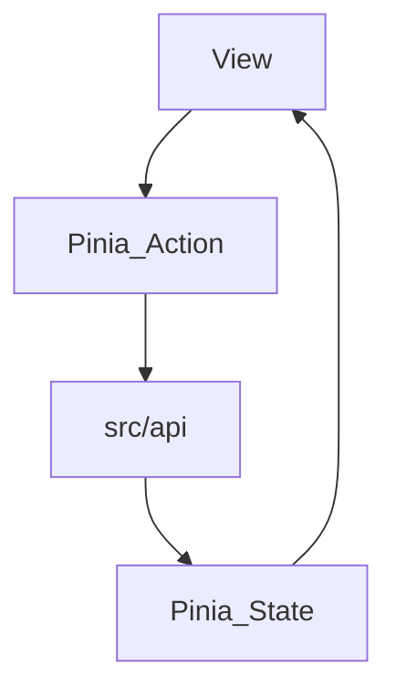

## 全后端重构方案（教师助手 Web）

> 目标：将当前“本地 Pinia 持久化”为主的实现，重构为**所有业务数据均走后端**，前端仅做展示与交互；同时**移除云端备份/云同步等云端功能**。

---

### 1) 总体目标与原则

- **数据唯一来源**：班级/学生/分组/积分/积分项/商城商品/兑换记录等，全部以**后端为准**。
- **前端不再本地保留业务数据**：不再使用 localForage/localStorage/IndexedDB 作为业务数据存储。
    - 允许保留少量**纯 UI 偏好**（例如布局模式、折叠状态）在 localStorage（可选）。
- **移除云端功能**：删除云端同步、历史备份、从节点恢复等入口与相关逻辑（包含 UI、store、api）。
- **Excel 全部后端化**：导入由前端解析数据之后调用后端批量创建接口进行导入，导出由后端生成文件，前端只负责上传与下载。
- **工具箱不持久化**：计时器/点名器/抽奖器保持纯前端运行（不写入后端）。

---

### 2) 现状摘要（基于源码）

- `src/views/` 中，真正调用 `src/api/*` 的页面主要是：
    - `src/views/AuthView.vue`（登录/注册/邮箱验证码）
    - `src/views/SettingsView.vue`（授权码验证 + 云同步入口）
    - `src/views/OpinionView.vue`（提交反馈）
- 但 `src/api/` 已经定义了后端能力：
    - `src/api/auth.ts`（认证）
    - `src/api/class.ts`（班级 CRUD）
    - `src/api/student.ts`（学生 CRUD + 分组管理）
    - `src/api/points.ts`（积分规则/规则组/加扣分/记录列表）
    - `src/api/mall.ts`（商城商品/兑换/记录）
    - `src/api/cloud.ts`（云同步：计划移除）

结论：可以走“**先接入已有接口、再补齐缺口接口**”的渐进式迁移，而不是推倒重写。

---

### 3) 后端领域模型与前端数据流（建议）

- **后端领域对象（后端拥有，前端只消费）**
    - 班级：Class
    - 学生：Student
    - 学生分组：StudentGroup
    - 积分规则：PointsRule
    - 规则分组：PointsRuleGroup
    - 加扣分记录：PointsApplyRecord
    - 商城商品：MallPrize
    - 兑换记录：MallExchangeRecord

- **前端数据流（统一范式）**

- store 只维护：
    - 当前页面需要的**内存态缓存**（state）
    - loading/error
    - 以及必要的分页/筛选参数

---

### 4) API 缺口补齐（Excel 后端化 + 列表分页/过滤）

你当前的 `src/api/` 覆盖了核心 CRUD，但以下能力在前端功能中出现、而 `src/api` 尚未覆盖或不足以支撑“全后端化”：

#### 4.1 Excel 导入（上传文件）
- 学生导入：`POST /import/students?class_id=...`（上传 Excel）
- 分组导入：`POST /import/student-groups?class_id=...`
- 积分项导入：`POST /import/points-rules`
- 积分导入：`POST /import/points-records?class_id=...`
- 商城商品导入：`POST /import/mall-prizes`

#### 4.2 Excel 导出（下载文件）
- 最终积分导出：`GET /export/points/final?class_id=...&scope=...&filters=...`
- 积分历史导出：`GET /export/points/history?class_id=...&range=...`

#### 4.3 列表分页/搜索/排序（为替代前端本地过滤准备）
- 学生列表：`studentApi.list(query)` 建议支持 `page/page_size/keyword/sort/group_id` 等
- 积分记录：`pointsApi.listApplyRecords(query)` 建议支持 `class_id/page/page_size/student_keyword/group_id/sign/item_id/range` 等
- 商城：`mallApi.listPrizes/listPrizeRecords` 建议支持分页与筛选

> 前端落地方式：新增 `src/api/import.ts`、`src/api/export.ts`（或按领域拆分）封装这些新接口。

---

### 5) 前端 Store 重构（去持久化）

重点调整：
- `src/stores/*Store.ts`
    - 移除业务数据本地持久化（localForage 等），仅保留必要 UI 偏好（可选）。
    - 对齐接口动作：
        - `fetchList/fetchDetail/create/update/delete`
        - `reset()`（切换账号或退出登录时清空内存态）
    - 统一 loading/error：避免页面各自 try/catch 重复。
- `src/utils/storage.ts`
    - 与“本地备份导出/导入、云同步导入”相关逻辑会被弃用或删除。

---

### 6) 页面迁移顺序（建议按用户主路径 + 风险最低）

#### 阶段 1：班级/学生/分组（`/students`）
- 目标：刷新页面后数据仍在（后端持久化），且前端不再依赖本地 store 存储。
- 页面：`src/views/ClassView.vue`
- 接口：`classApi.*` + `studentApi.*`
- Excel：替换本地解析为“上传到后端导入”。

#### 阶段 2：积分（`/points` 与 `/points/history`）
- 页面：
    - `src/views/PointsView.vue`
    - `src/views/PointsHistoryView.vue`
    - `src/components/PointsHeaderActions.vue` 相关按钮
- 接口：`pointsApi.*`
- 积分项：用 `pointsApi` 的规则/规则组替换本地积分项 store。
- 导入/导出：全部后端化。

#### 阶段 3：商城（`/points/shop`）
- 页面：`src/views/ShopView.vue`
- 接口：`mallApi.*`
- 兑换逻辑：必须后端事务化（扣积分 + 减库存 + 写记录原子性）。

#### 阶段 4：设置页清理云端（`/settings`）
- 页面：`src/views/SettingsView.vue`
- 移除：`src/components/CloudSyncSettings.vue`、`src/api/cloud.ts` 引用链、settingsStore 中云同步状态
- 保留：授权码验证（若你仍需要授权体系）。

#### 阶段 5：工具箱保持纯前端（`/tools/*`）
- 计时器：纯前端。
- 点名器：可读取后端学生/分组数据，但不需要记录/持久化。
- 抽奖器：纯前端（不落库）。

---

### 7) 迁移策略（避免一次性大爆炸）

- **逐页迁移**：每次只改一个模块（Class -> Points -> Shop -> Settings）。
- **临时双通道（仅开发期）**：store 内可以短期保留 `useBackend` 开关对照旧逻辑；上线前删掉。
- **数据一致性**：
    - 积分以“记录”为事实来源，钱包/可用积分由后端计算或在后端事务更新。
    - 商城兑换必须后端原子化。

---

### 8) 关键文件清单（落地时最先动）

- Views：
    - `src/views/ClassView.vue`
    - `src/views/PointsView.vue`
    - `src/views/PointsHistoryView.vue`
    - `src/views/ShopView.vue`
    - `src/views/SettingsView.vue`

- Stores：
    - `src/stores/classStore.ts`
    - `src/stores/studentStore.ts`
    - `src/stores/studentGroupStore.ts`
    - `src/stores/pointsStore.ts`
    - `src/stores/pointsItemStore.ts`
    - `src/stores/shopStore.ts`
    - `src/stores/settingsStore.ts`（云同步相关移除）

- API：
    - 复用：`src/api/{auth,class,student,points,mall}.ts`
    - 移除：`src/api/cloud.ts`（以及所有引用）
    - 新增：`src/api/import.ts`、`src/api/export.ts`（Excel 后端化）

---

### 9) 验收标准（完成后应满足）

- 登录后创建/编辑的班级、学生、分组、积分、商城数据：**刷新页面仍存在**（后端持久化）。
- 前端无业务数据本地持久化（localForage/localStorage/IndexedDB 不再存业务实体）。
- 设置页不再出现云同步/历史恢复入口；代码层面不再引用 `cloudApi`。
- Excel 导入/导出均通过后端接口完成。
